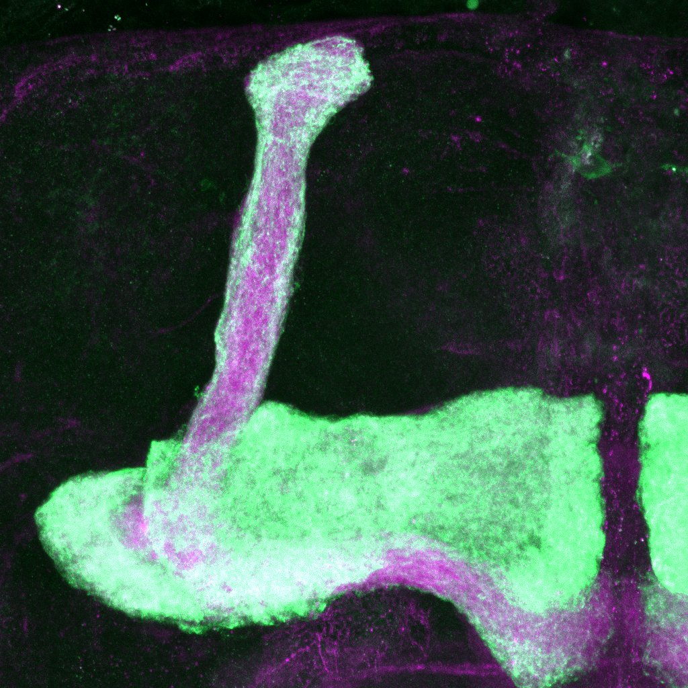

## About me
Hello, my name is [Neta](https://weizmann.elsevierpure.com/en/persons/neta-hanuka/), I am a first year PhD sutdent in the lab of [Oren Schuldiner](https://www.weizmann.ac.il/mcb/Schuldiner/home) at the Weizmann Insitute of Science. We study the process of **pruning** and **neuronal remodeling** using the model system of the _Drosophila Melanogater_ or Fruit fly.

## Stay in touch

[Email me](malito:neta.hanuka@weizmann.ac.il)

  

